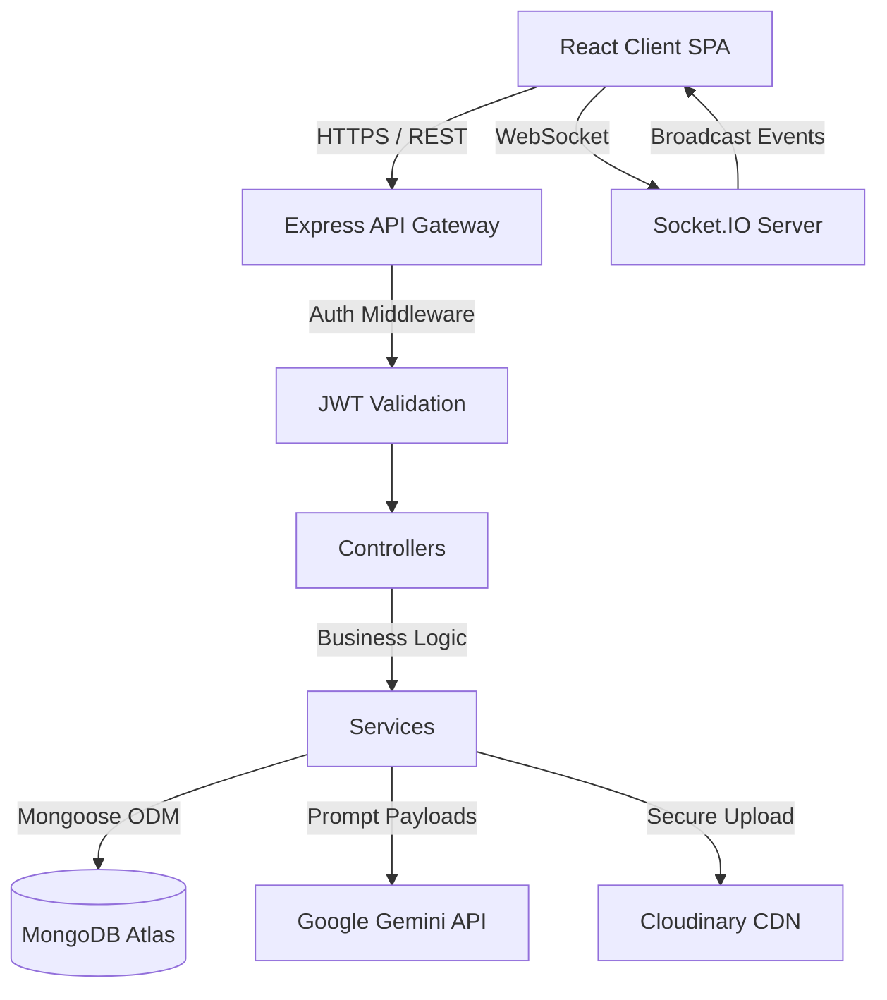
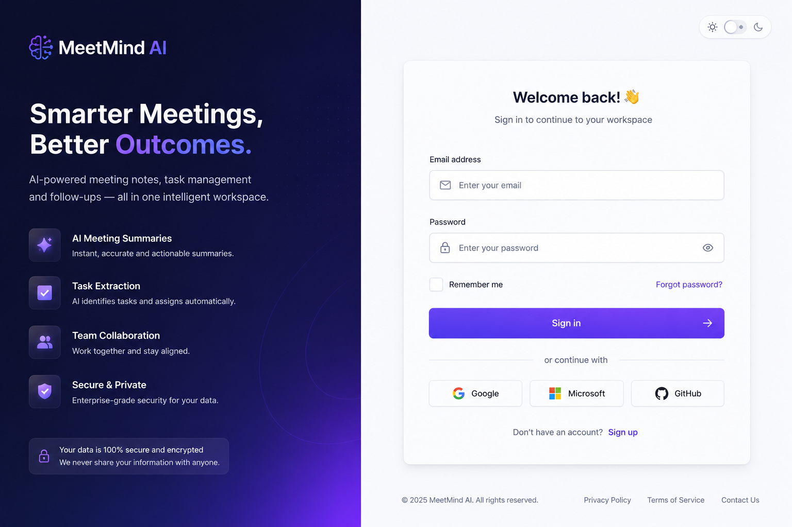
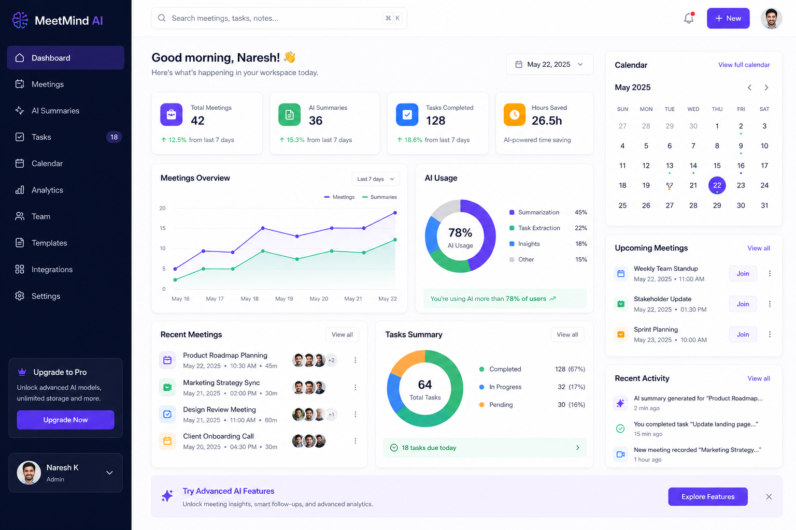
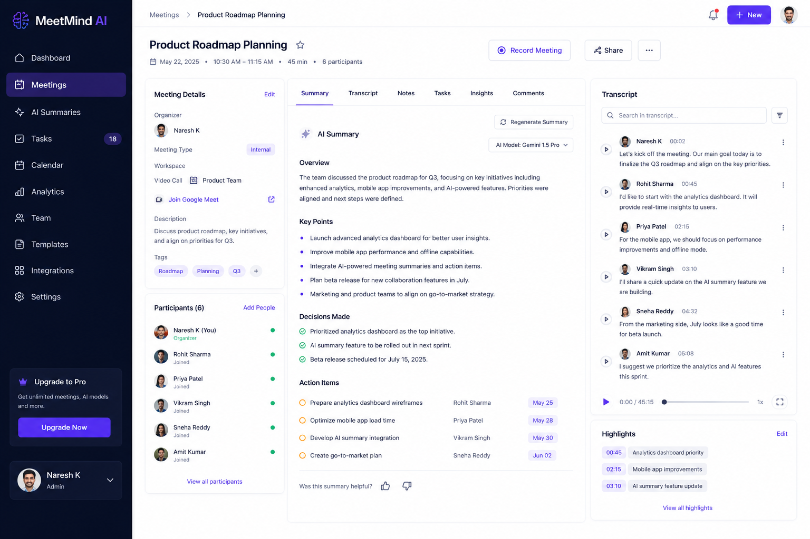
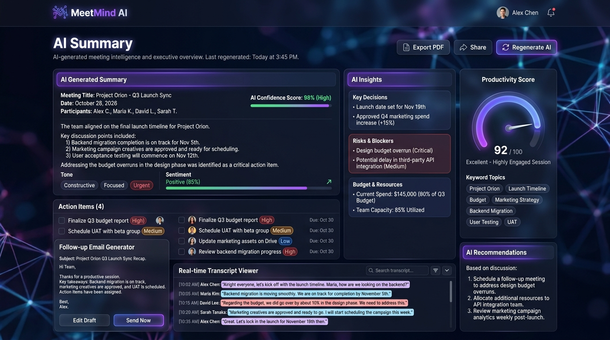
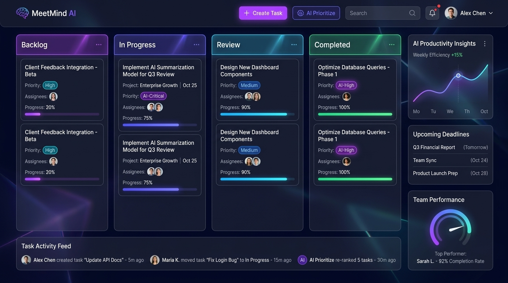
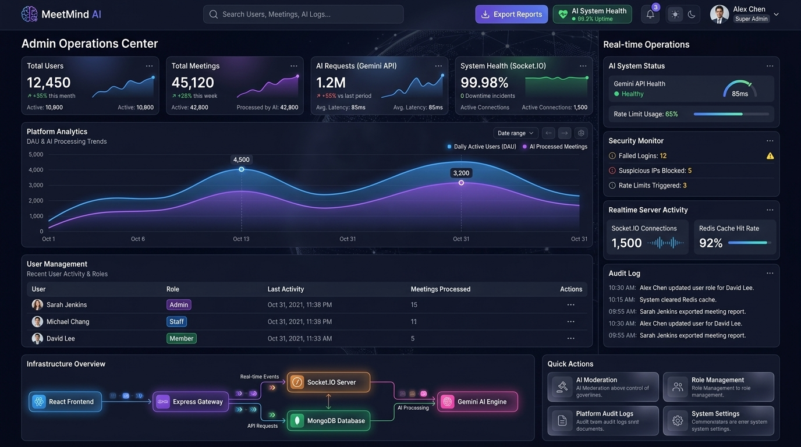
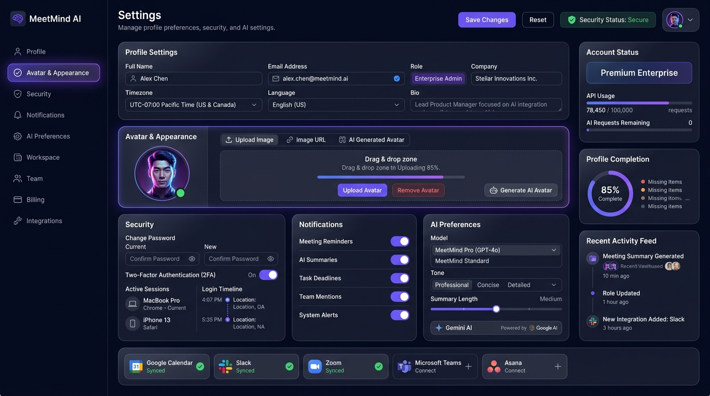
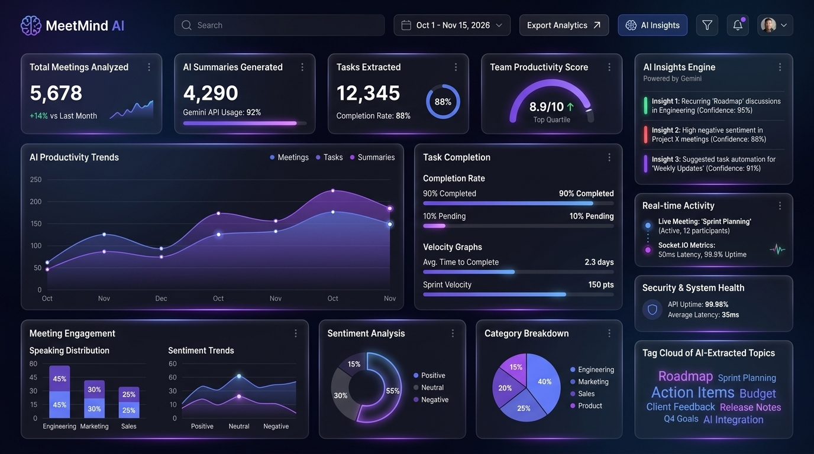

<div align="center">
  

  <h1>MeetMind AI</h1>
  <p><strong>AI-Powered Meeting Notes & Task Manager SaaS</strong></p>

  <p>Transforming disorganized meetings into actionable insights with generative AI.</p>

  <div>
    
    
    
    
    
    
    
    
    
    
    
  </div>
</div>

---

## 📖 Short Description

MeetMind AI is a production-grade Software-as-a-Service (SaaS) platform designed to revolutionize meeting productivity. By leveraging Google's Gemini AI, the platform seamlessly analyzes meeting notes, automatically extracts actionable tasks, and generates comprehensive summaries and follow-up communications. 

Built with scalability and security in mind, the architecture implements a robust Role-Based Access Control (RBAC) system for multi-tenant environments. The secure backend infrastructure utilizes hardened authentication flows (JWT with refresh token rotation, HttpOnly cookies) and optimized media pipelines, establishing a highly performant and secure foundation suitable for enterprise meeting management.

---

## ✨ Features

### 🤖 AI Features
- **AI Meeting Summaries:** Context-aware compression of extensive meeting transcripts.
- **AI Task Extraction:** Automated identification and assignment of action items from free-form notes.
- **Follow-up Email Generation:** Instant drafting of professional follow-up communications based on meeting outcomes.
- **Meeting Insights:** Thematic analysis and decision tracking.
- **Productivity Workflows:** Automated pipelines bridging notes to project execution.

### 👥 User Features
- **Meeting Management:** Complete lifecycle handling for user workspaces.
- **Notes Editor:** Rich-text environment for real-time meeting capture.
- **Task Board:** Kanban-style visualization of AI-extracted action items.
- **Avatar Management:** Personalized user profiles with remote media support.
- **Responsive Dashboard:** Optimized multi-device experience with modern aesthetic.

### 🛡️ Admin Features
- **Analytics Dashboard:** Platform-wide usage metrics and system health monitoring.
- **User Management:** Centralized control over platform tenancy.
- **Platform Monitoring:** Visibility into API utilization and error rates.
- **RBAC System:** Granular permission structures ensuring tenant isolation.

### 🔒 Security Features
- **JWT Auth Strategy:** Stateless session management with cryptographic verification.
- **Access + Refresh Tokens:** Secure rotation mechanisms mitigating token theft.
- **HttpOnly Cookies:** Protection against XSS payload extraction.
- **Helmet Integration:** Enforced HTTP header security policies.
- **Rate Limiting:** Algorithmic protection against brute-force and DDoS vectors.
- **Secure Uploads:** Strict MIME-type validation and payload sizing.
- **Protected APIs:** Middleware-enforced route authorization.

### 🖼️ Media Features
- **Cloudinary Avatar Uploads:** Direct-to-cloud media pipeline reducing server load.
- **Avatar URL Support:** External OAuth and remote image compatibility.
- **Realtime Avatar Sync:** Immediate visual updates across active sessions.
- **Drag & Drop Uploads:** Frictionless user experience for asset management.

---

## 🛠️ Tech Stack

### Frontend Architecture
| Technology | Role |
|------------|------|
| **React** | Core component-based UI library |
| **TypeScript** | Strict static typing for enterprise scalability |
| **Vite** | Blazing-fast build tool and dev server |
| **Tailwind CSS** | Utility-first styling for rapid, consistent UI |
| **Zustand** | Lightweight, scalable global state management |
| **React Query** | Asynchronous state and server cache synchronization |
| **Framer Motion** | Physics-based animation library for micro-interactions |

### Backend Infrastructure
| Technology | Role |
|------------|------|
| **Node.js & Express** | High-throughput asynchronous runtime and routing |
| **MongoDB & Mongoose** | NoSQL document persistence and schema validation |
| **JWT** | Cryptographic session state encoding |
| **Cloudinary** | Cloud-native media optimization and CDN |
| **Multer** | Multipart/form-data payload parsing |
| **Gemini API** | State-of-the-art LLM for natural language processing |

### DevOps & Infrastructure
| Service | Purpose |
|---------|---------|
| **Vercel** | Edge-optimized frontend deployment |
| **Render/Railway** | Scalable containerized backend hosting |
| **MongoDB Atlas** | Fully managed global database cluster |
| **Cloudinary** | Asset storage and delivery network |

---

## 📐 Architecture

MeetMind AI follows a modern, decoupled client-server architecture optimized for real-time collaboration and heavy AI processing.

- **Frontend Layer:** A Vite-compiled React SPA leveraging React Query for efficient data fetching and Zustand for local state, providing a highly responsive user experience.
- **Backend Layer:** An Express REST API architected with the controller-service-route pattern, ensuring clean separation of business logic and HTTP transport.
- **AI Service Layer:** Dedicated asynchronous services interfacing with the Gemini API, handling prompt engineering and response parsing with robust error fallback mechanisms.
- **Authentication Flow:** A hardened implementation using short-lived access tokens delivered via JSON payloads and long-lived refresh tokens stored securely in HttpOnly, SameSite cookies.
- **MongoDB Persistence:** Highly normalized collections with strategic indexing for rapid query execution across workspaces and tasks.
- **Cloudinary Media Pipeline:** A streamlined upload process where the backend validates the file stream before securely transferring it to Cloudinary, storing only the optimized CDN URL in the database.
- **Realtime Update System:** Socket.IO implementation enabling instantaneous state synchronization across connected clients for collaborative editing.



---

## 📸 Screenshots
### Login & Authentication


### Workspace Dashboard


### Meetings Workspace


### AI Summary Generation


### Tasks Board


### Admin Dashboard


### Settings & Avatar Upload


### Analytics


---

## ⚙️ Installation & Local Setup

Clone the repository to your local machine:
```bash
git clone https://github.com/yourusername/meetmind-ai.git
cd meetmind-ai
```

### 1. Frontend Setup
```bash
cd frontend
npm install
npm run dev
```
The frontend will start on `http://localhost:5173`.

### 2. Backend Setup
```bash
cd backend
npm install
npm run dev
```
The backend will start on `http://localhost:5000`.

---

## 🔐 Environment Variables

Ensure you create `.env` files in both the `backend` directories before running the application.

### Backend (`backend/.env`)
```env
PORT=5000
MONGO_URI=mongodb+srv://<user>:<password>@cluster.mongodb.net/meetmind
JWT_SECRET=your_super_secure_access_token_secret
JWT_REFRESH_SECRET=your_super_secure_refresh_token_secret
CLIENT_URL=http://localhost:5173
GEMINI_API_KEY=your_google_gemini_api_key
CLOUDINARY_CLOUD_NAME=your_cloud_name
CLOUDINARY_API_KEY=your_api_key
CLOUDINARY_API_SECRET=your_api_secret
```
---

## 🛡️ Deep Dive: Security Features

MeetMind AI implements strict security protocols appropriate for a SaaS handling sensitive meeting data:
- **Helmet:** Automatically sets critical HTTP headers to prevent MIME-sniffing and clickjacking.
- **CORS:** Strictly configured Cross-Origin Resource Sharing allowing only the verified frontend origin.
- **express-rate-limit:** Global and route-specific limiters mitigating brute-force password attacks and DDoS vectors.
- **cookie-parser & Secure Cookies:** Refresh tokens are extracted into `HttpOnly`, `SameSite=Strict`, and `Secure` (in production) cookies, rendering them inaccessible to client-side scripts.
- **Upload Validation:** The Multer pipeline strictly verifies MIME types (images only) and enforces size limits before processing.
- **JWT Protection:** Access APIs require Bearer token validation through custom middleware.
- **API Security & RBAC:** Endpoints strictly verify user roles (Admin vs. User) ensuring horizontal and vertical privilege escalation is prevented.

---

## 🧠 Deep Dive: AI Workflow System

The core value proposition relies on our specialized AI Workflow System powered by Google's Gemini API:
1. **Ingestion:** Raw meeting notes and transcripts are sanitized and parsed.
2. **Contextual Analysis (Gemini Integration):** The API is queried with heavily optimized, few-shot prompts to establish meeting context and desired output formats.
3. **AI Summary Generation:** The engine synthesizes the transcript into a high-level executive summary, extracting key decisions.
4. **Task Extraction:** Distinct action items are identified, assigned to detected entities, and formatted into structured JSON data for the database.
5. **Follow-up Email Pipeline:** A secondary prompt chain generates professional emails based on the newly extracted summary and tasks, ready for user review.

---

## 👤 Avatar Management System

To ensure a personalized experience, the platform handles complex avatar logic:
- Users can upload local files via a drag-and-drop interface.
- Files are temporarily buffered, validated, and streamed to **Cloudinary**.
- The system supports external Avatar URLs (e.g., from Google OAuth) seamlessly.
- Real-time Avatar Sync ensures that when an avatar is updated, the change propagates immediately across the UI.

---

## ⚡ Performance Optimizations

- **Database Indexing:** Strategic compound indexes on User IDs and Workspaces ensure sub-millisecond query execution.
- **Connection Pooling:** Optimal MongoDB connection pool sizing prevents socket exhaustion under load.
- **React Query Caching:** Smart client-side caching minimizes redundant network requests while ensuring data freshness.
- **Lazy Loading:** Frontend components and heavy assets are dynamically imported to maintain a low initial bundle size and rapid First Contentful Paint (FCP).

---

## 🚀 Deployment

The platform is designed for zero-downtime deployments using modern CI/CD pipelines:
- **Vercel:** Hosts the frontend, leveraging its global Edge Network for instantaneous asset delivery and optimized routing.
- **Render / Railway:** Hosts the Node.js backend. Environment variables dictate production behavior, including enforcing **HTTPS requirements**, enabling **secure cookies**, and tightening **CORS setup**.
- **MongoDB Atlas:** Houses the production database in a secure VPC with IP whitelisting.
- **Cloudinary:** Serves as the dedicated media CDN for highly optimized image delivery based on client device capabilities.

---

## 🔮 Future Improvements

The roadmap for MeetMind AI includes scaling enterprise capabilities:
- **Calendar Integrations:** Two-way sync with Google Calendar and Outlook.
- **Speech-to-Text Transcription:** Real-time audio processing during live meetings.
- **Redis Caching:** Implementation of a caching layer for high-frequency queries and rate-limiter optimization.
- **Team Collaboration:** Shared workspaces with granular multi-user editing.
- **AI Memory System:** Cross-meeting context retention using vector databases (e.g., Pinecone).
- **Notification System:** Push, email, and Slack integrations for task reminders.

---

## 💼 Resume Value

MeetMind AI demonstrates advanced proficiency in full-stack engineering, system design, and AI integration. It highlights an understanding of production constraints including security, scalability, state management, and modern cloud infrastructure.

---

## 📄 License

This project is licensed under the MIT License - see the [LICENSE](LICENSE) file for details.

---

<div align="center">
  <p>Built with passion by the <strong>MeetMind AI Team</strong></p>
  
  <a href="https://github.com/naresh-kamarthy" target="_blank">
    
  </a>
  <a href="https://www.linkedin.com/in/naresh-kamarthy-aa1239130" target="_blank">
    
  </a>
  <a href="https://naresh-kamarthy-portfolio.vercel.app" target="_blank">
    
  </a>
</div>
